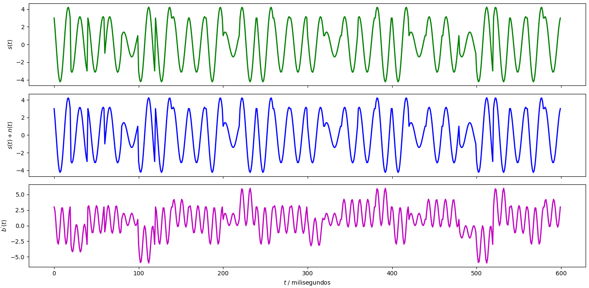
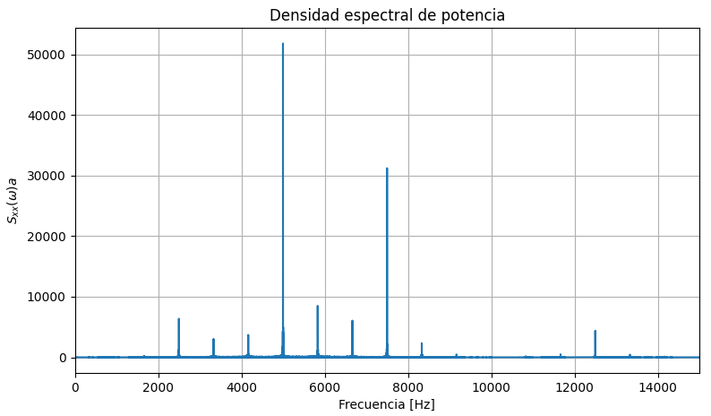
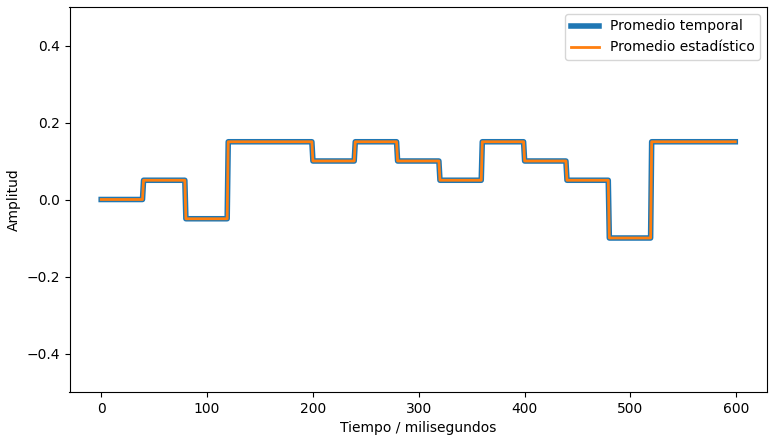

# Resultados del Proyecto 4

## Observaciones legales
Ver el archivo LICENSE :)

# Descripción de la solución
Andrés Barrantes Silman - B81020 - Grupo 2

## Introducción
Después de quebrarme la cabeza por 12 horas seguidas,
logré resolver los bugs que tenía mi código.

La "prueba de energía" funciona para demodulación, con
el cuidado de que para la segunda portadora la prueba
se invierte. Además se debe de agregar una prueba de amplitud, 
para la cual se eligió 2.5 como punto medio.

Al ajustar la SNR a 20 se obtiene (usualmente) cero errores de transmisión, pero
si se baja hasta ser negativa, la cifra de errores aumenta a ritmo
acelerado - esto tiene sentido pues al tratarse de modulación
por amplitud (además de fase), la señal pierde inmunidad al ruido.

La mayoría del código fue heredado del profesor.

## Modulador y demodulador
Se crea una expresión matemática que calcula la onda a emitir con base
en los cuatro bits del 16-QAM y las dos ondas portadoras (seno y coseno).

```python
Pulso = (-1)**(1+bits[i]) * 3**(1-bits[i+1]) * portadora1 + (-1)**(bits[i+2]) * 3**(1-bits[i+3]) * portadora2
```

El demodulador analiza la amplitud (valor máximo por conjunto de muestras)
y fase (prueba de energía), con el fin de extraer los cuatro bits por "pulso".

La creación de las funciones e investigación sobre el funcionamiento del 
16-QAM duró, sumadas, aproximadamente 13 horas.

Para la SNR de 20, se obtiene una transmisión limpia, aunque a veces aparece
uno que otro error, estos ni se perciben:

![SNR = 20 \[dB\]](res/txrx.png)

Las señales asociadas son las siguientes:



## Densidad espectral de potencia
Directamente se utilizó el código proporcionado por el profesor. Se observa
un pico en los 5000 \[Hz\], lo cual es de esperar pues a ésta frecuencia es
que se transmite originalmente.



## Estacionaridad y ergodicidad
Si las funciones están bien hechas, se puede decir que el proceso es ergódico,
pues el promedio temporal y el estadístico, en cada "periodo" se aproximan demasiado.
Esto es sensato. pues se anticipa que dados muchos bits transmitidos, el promedio de
todas las señales juntas, temporal y estadístico, se asemeje a cero; no obstante, la
muestra elegida deberá de ser más grande.

El proceso no se puede clasificar como estacionario, pues de un solo se
ve, en la figura adjunta, que el promedio cambia con el tiempo. Esto tiene sentido
al tratarse de una transmisión de bits, caso contrario, podría dar la idea que
todos los datos son iguales, dado que hay modulación por **fase y amplitud**.

Por ejemplo, el promedio temporal de las señales correspondientes a los bits 0011 y
1111 claramente no será el mismo.


